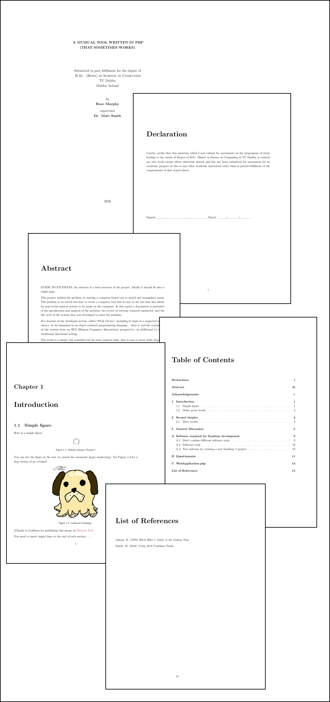
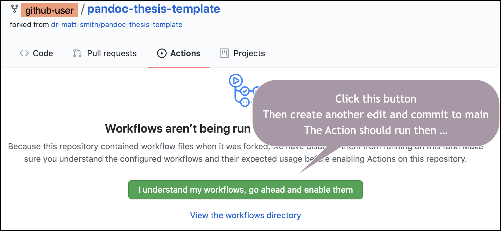
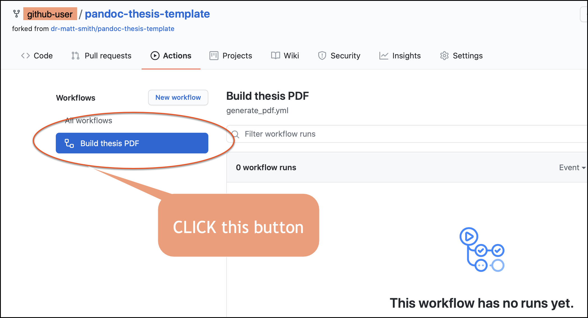
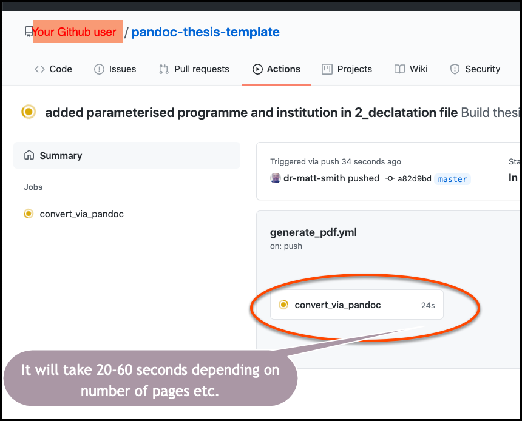
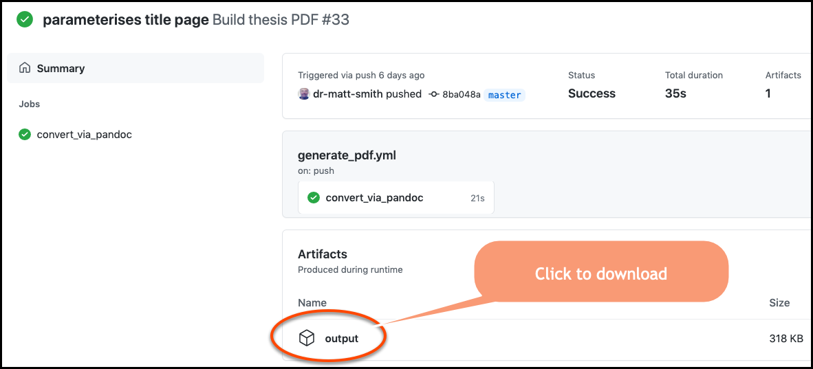
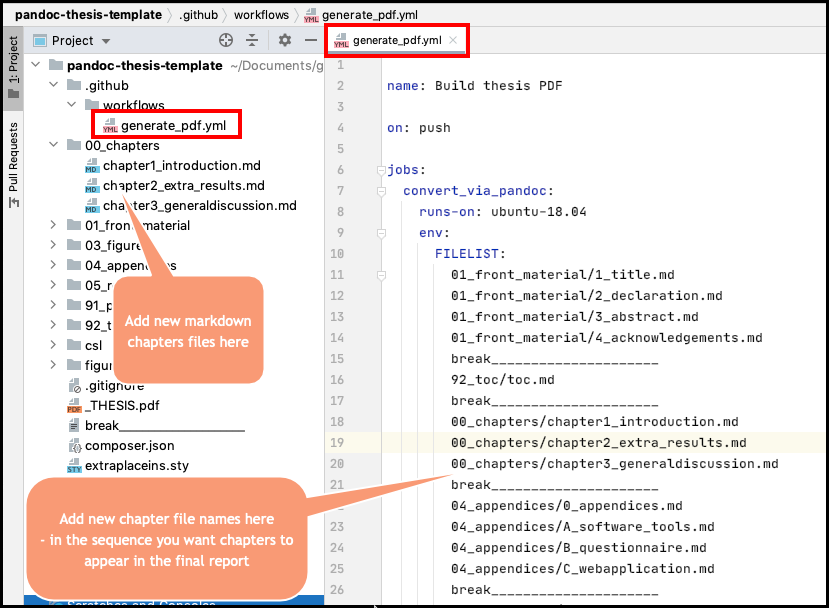

pandoc-thesis-template
======================

A template for creating a degree project thesis in markdown + pandoc

## Example of what you can generate EASILY

Here is the type of PDF thesis document you can easily generate using this repository template:



## BREAKING NEWS - it's all automatic via Github Actions

you now do not need to install ANY software locally - once you've created a FORK of this project, and commit new changes, then a Github Action will run to create a new thesis PDF for you

follow these steps:

1. Create a FORK of this repository project
[https://github.com/dr-matt-smith/pandoc-thesis-template](https://github.com/dr-matt-smith/pandoc-thesis-template)

1. Git clone your forked repository to your local machine

1.  Edit some bits
    - E.g. title parameters in: `01_front_material/1_title.md`
    - Change the text in chapter 1: `00_chapters/chapter1_introduction.md`
    - NOTE: markdown is great – just write text / #heading1 / ##heading2 / - for bullet list / 1 for numbered list and so on ..
    - here are more details about [GitHub Markddown](https://guides.github.com/features/mastering-markdown/)
 
 


1. back on the Github repository settings, select `Actions` 

1. click the Green button to enable workflows




1.  click the `Build thesis PDF` action


 
1. It will take something like 25-60 seconds (depending on number of pages / complexity of document - but remmeber, this is a free Linux virtual machine from Github :-):



1. Look at the OUTPUT for the Github ACTIONS – you should be able to download a newly created PDF of the thesis !



Github actions runs a Linux machine and runs [PanDoc](https://pandoc.org/) and [Latex](https://www.latex-project.org/) and builds the PDF from the files !

## Add / remove chapters from your thesis

Add / remove chapters/appendices from the `00_chapters` and `04_appendices` folders. But you must also update file `.github/workflows/generate_pdf.yml` to match the sequence of chapters/appendices you want.



## work on your local machine

if you still wish to work on your local machine (why???!!) then here are details in the [old README](README_OLD.md)

## References

Add to the collection of references in `/99_references/references.bib`

Only items that are cited will be added to the list of refernces in the generated PDF.

## Citations

To cite a reference item write the 'id' of the reference item in square brackets with an '@-at' sign as follows:

    Lots of people have written about how wonderful Pandoc is, for example see [@smith2017].

where in the above `smith2017` is the unique 'id' of the reference item. This would output something like this (if citations mode is Harvard-Limerick):

    Lots of people have written about how wonderful Pandoc is, for example see (Smith 2017).


In a LaTeX BibText reference collection this 'id' comes immediately after the opening brace `{`:

        @article{smith2017,
        author = {Smith, Matt},
        title = {{Some paper about something}},
        journal = {Great papers in compting (Dublin, Ireland)},
        year = {2017},
        volume = {1},
        pages = {1--19}
        }


To cite a reference item without the authors' names, but just have the year/alpha bit, prefix the citation with a minus sign, e.g.:

        Smith [-@smith2017] writes about how wonderful Pandoc is.

would output something like this (if citations mode is Harvard):

        Smith (2017) writes about how wonderful Pandoc is.

## URLs for online sources


For BibTeX references then

- add a "url" and "accessed" field

    - e.g.
    
        ```
        @book{smith2018,
            author = {Smith, Matt},
            title = {Unity 2018 Cookbook},
            publisher = {Packt},
            year = {2018},
            url = {https://www.packtpub.com/eu/game-development/unity-2018-cookbook-third-edition},
            accessed = {2020}
        }
        ```

## Figures

Copy the figure image into folder `03_figures`. E.g. copy the `octocat.png` Github image there.

Use the exclamation mark, followed by caption text (in square brackets), and then path to image file (in parentheses round brackets), e.g.:

```
    
```

## Citing numbered figures

You can cite the figure number in the text (to match the automatic figure numbering) by adding a `\label{<label>}` in the figure line, and using `\ref{<label>}` in your text to get the figure number, e.g.:

```
    See Figiure \ref{octocat} to see the famous Github Octocat logo.

    
```


## Further reference

Find some more Pandoc templates here:

- https://github.com/jgm/pandoc/wiki/User-contributed-templates

## Using BibTeX  for reference database

For more about CSL and BibTeX see [README REFS](README_REFS.md)

## Acknowledgements

This thesis template is based on the one published by Chia Kaivalya
https://chiakaivalya.wordpress.com/2014/04/23/using-markdown-pandoc-to-write-my-biology-phd-thesis/

Thanks Chia!

## Write, then refine ...

"First, you catch your fish, then you need to fillet your fish until you serve the finest piece" 
(Claus Toksvig being quoted by daughter Sandi in Willams 2020)

REFERENCES:
Williams, Z. (2020) "Interview with Sandi Toksvig",  The Guardian newspaper, UK, 25 May 2020.
