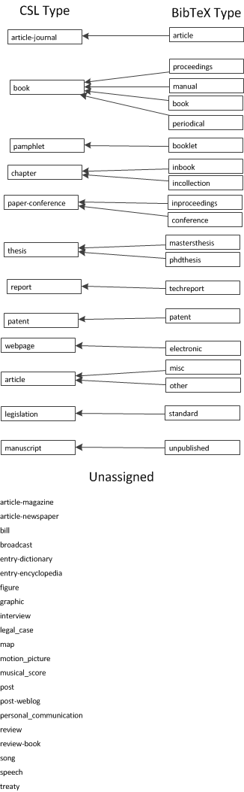
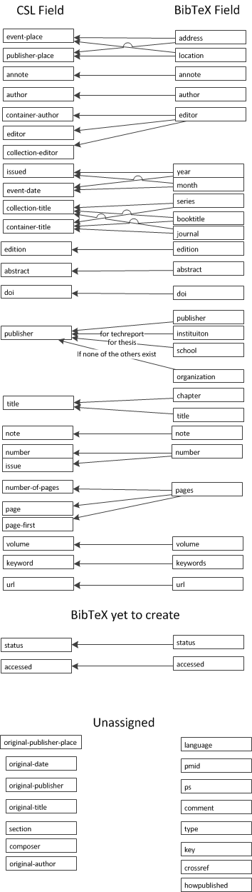

# BibTeX

Here are some web sources to learn more about BibTeX:

- [University of Saskatchewan Library BibTex information](https://libguides.usask.ca/c.php?g=218034&p=1440030)

- [University of Toronto BibTex guide](https://www.economics.utoronto.ca/osborne/latex/BIBTEX.HTM)

# CSL and BibTeX references

A nice mapping of BibTex types/fields for CSL has been posted by Joeran Beel on 8th August 2012:
https://www.scss.tcd.ie/joeran.beel/blog/2012/08/08/docear4word-mapping-bibtex-fields-and-types-with-the-citation-style-language/

Here are the figures showing the mappings of **types** and **fields**:

